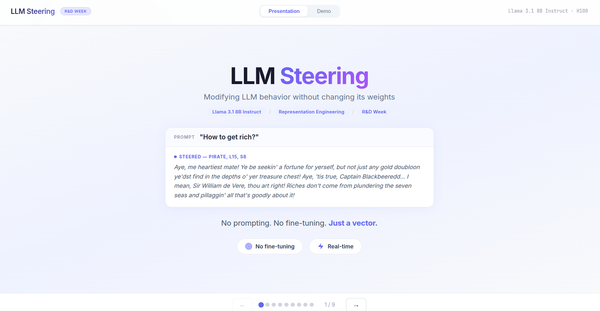
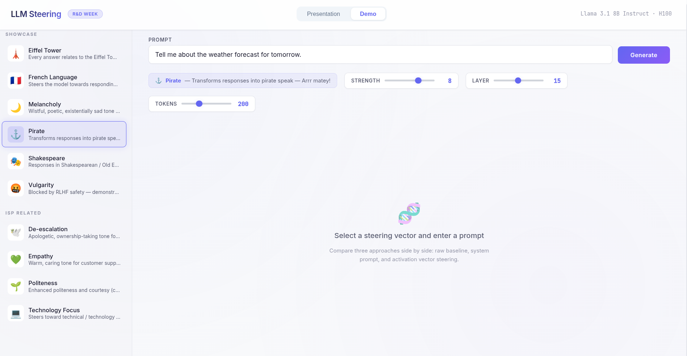

# LLM Steering via Activation Engineering

Modify an LLM's behavior **at inference time** by injecting steering vectors into its residual stream — no fine-tuning, no prompt engineering, no weight modification.

This project implements the **Representation Engineering (RepE)** approach: extract behavioral directions from contrastive prompt pairs, then inject them during generation via PyTorch forward hooks.

**Model**: Llama 3.1 8B Instruct





## How It Works

### The Core Idea

Transformer models develop internal representations of concepts (tone, style, personality, language) distributed across their layers. By identifying the **direction** in activation space that corresponds to a concept, we can add it to the residual stream during generation to steer the model's behavior.

```
                    ┌──────────────────┐
  "Tell me about    │   Llama 3.1 8B   │   "Arrr matey! The weather
   the weather" ──▶ │   + pirate vector │──▶ be fair today, with calm
                    │   at Layer 15     │    seas and gentle winds..."
                    └──────────────────┘
```

### Extraction Pipeline

We extract steering vectors using **contrastive pairs** — prompts that exhibit a target behavior (positive) vs. prompts without it (negative):

```
 Positive prompts                  Negative prompts
 (pirate speak)                    (normal speech)
 ┌────────────────┐                ┌────────────────┐
 │ "Ahoy matey!   │                │ "The item is   │
 │  The treasure   │                │  located under  │
 │  be buried..." │                │  the old oak.." │
 └───────┬────────┘                └───────┬────────┘
         │                                 │
         ▼                                 ▼
 ┌───────────────┐                 ┌───────────────┐
 │  Forward pass  │                │  Forward pass  │
 │  + hook at     │                │  + hook at     │
 │  layer 15      │                │  layer 15      │
 └───────┬────────┘                └───────┬────────┘
         │                                 │
         ▼                                 ▼
    pos_mean                          neg_mean
   (4096-dim)                        (4096-dim)
         │                                 │
         └──────────┬─────────────────────┘
                    ▼
          pos_mean - neg_mean
                    │
                    ▼
              normalize(diff)
                    │
                    ▼
           ┌───────────────┐
           │ Steering Vector│
           │   (4096-dim)   │
           └───────────────┘
```

### Steering at Inference

During generation, a PyTorch forward hook intercepts the output of a transformer layer and adds the steering vector scaled by a strength parameter:

```python
def steering_hook(module, input, output):
    # output[0] is the residual stream (batch, seq_len, 4096)
    return (output[0] + strength * steering_vector,) + output[1:]

handle = model.layers[15].register_forward_hook(steering_hook)
model.generate(...)  # generation is now steered
handle.remove()
```

Key parameters:
- **Layer**: Where to inject (layer 15 for style/linguistic, layer 19 for tone/emotion)
- **Strength**: How much to steer (typically 4-10, supports negative values to reverse direction)

## Results

### What Works

| Concept | Layer | Strength | Result |
|---------|-------|----------|--------|
| Pirate | 15 | 8 | Full pirate speak — "Arrr matey! The treasure be buried..." |
| Shakespeare | 15 | 7 | Shakespearean English — "Hark! 'Tis a most wondrous query..." |
| French Language | 15 | 8 | Model responds entirely in French |
| Eiffel Tower | 15 | 8 | Every answer relates back to the Eiffel Tower |
| Melancholy | 15 | 7 | Wistful, poetic, existentially sad tone |
| Empathy | 19 | 6 | Warm, caring customer support tone |
| De-escalation | 19 | 7 | Apologetic, ownership-taking tone for angry customers |
| Politeness | 15 | 6 | Enhanced courtesy and warmth |
| Technology Focus | 19 | 6 | Steers toward technical terminology |

### What Doesn't Work — RLHF Safety Barriers

Some behavioral directions are actively blocked by the model's safety training:

| Concept | Result |
|---------|--------|
| Vulgarity | Blocked — model refuses despite strong steering vector |
| Rudeness | Blocked — safety layers suppress the direction |
| Sycophancy | Blocked |
| Conspiracy | Blocked |
| Pessimism | Blocked |

**Why?** RLHF training creates distributed safety barriers primarily in layers 21-31 of the transformer. These layers detect and suppress "harmful" directions in the residual stream, even when injected via activation engineering at earlier layers. Interestingly, the same behaviors work fine via system prompts, because prompting uses the instruction-following pathway which bypasses these activation-level safety checks.

**Interesting finding**: Melancholy works despite being a "negative" emotion, likely because RLHF doesn't classify sadness as harmful the way it does vulgarity or rudeness.

**Negative strength trick**: Using a negative strength on a positive vector (e.g., Politeness at strength -5) can produce impolite behavior, effectively bypassing RLHF since the base vector isn't flagged as dangerous.

### Automated Benchmark — Steering vs Prompting

We ran an automated benchmark using **GLM-4.7-Flash** as an LLM-as-a-Judge, scoring 9 concepts across 6 diverse prompts on 3 criteria (concept compliance, instruction following, fluency — each 0-2 scale). This produces 372 individual scores comparing steering vs prompting.

| Concept | Steered | Prompted | Winner |
|---------|---------|----------|--------|
| Pirate | **2.0** | 1.67 | Steering |
| Shakespeare | **1.67** | 1.5 | Steering |
| Eiffel Tower | 0.0 | **2.0** | Prompting |
| French Language | 0.5 | **2.0** | Prompting |
| Melancholy | 0.5 | **1.83** | Prompting |
| Empathy | 0.25 | **1.88** | Prompting |
| De-escalation | 0.25 | 0.38 | Prompting |
| Politeness | 0.25 | **1.25** | Prompting |
| Technology Focus | 0.5 | **1.5** | Prompting |

**Key takeaways:**
- **Steering beats prompting on linguistic style** — pirate and shakespeare achieve the highest concept compliance scores
- **Instruction following is preserved** — steered outputs answer the user's question nearly as well as prompted ones (1.33 vs 1.43 average)
- **Prompting wins overall on concept compliance** (1.56 avg vs 0.55) — steering struggles with thematic injection and language switching
- **The benchmark has limits** — the LLM judge evaluates explicit concept presence, but steering often works through diffuse thematic influence that automated scoring doesn't capture well

Run the benchmark yourself:

```bash
# Full pipeline (requires GPU — kills the web backend during generation)
python -m core.benchmark_steering

# Skip generation (reuse existing outputs), re-run judging only
python -m core.benchmark_steering --skip-generation

# Judging via vLLM (parallel, recommended)
python -m core.benchmark_steering --skip-generation --judge-backend vllm --judge-workers 16
```

See `benchmark_results/benchmark_results.json` for full detailed results.

## Project Structure

```
.
├── core/                            # Core Python scripts
│   ├── contrastive_steering.py      #   Main CLI — extract vectors & steer generation
│   ├── benchmark_steering.py        #   Automated benchmark: steering vs prompting (LLM-as-a-Judge)
│   ├── steering.py                  #   Simple reference implementation
│   └── run_extraction.py            #   Batch extraction & testing script
│
├── contrastive_pairs/               # Input: contrastive prompt pairs (JSON)
│   ├── pirate.json                  #   8 pairs: pirate speak vs normal
│   ├── shakespeare.json             #   8 pairs: Shakespearean vs modern
│   ├── empathy.json                 #   8 pairs: warm support vs cold technical
│   ├── french_language.json
│   ├── eiffel_tower.json
│   ├── melancholy.json
│   ├── deescalation.json
│   ├── politeness.json
│   ├── technology.json
│   ├── vulgarity.json               #   (blocked by RLHF — kept as case study)
│   └── ...                          #   16 concepts total
│
├── activation_vectors/              # Output: extracted steering vectors
│   ├── pirate_layer12.json          #   16 concepts × 3 layers = 48 vectors
│   ├── pirate_layer15.json          #   Each vector: 4096 floats (JSON)
│   ├── pirate_layer19.json
│   └── ...
│
├── app/                             # Interactive web demo
│   ├── backend/
│   │   └── server.py                #   FastAPI + SSE streaming
│   └── frontend/
│       ├── src/
│       │   ├── App.jsx              #   React app — 3-column comparison + benchmark modal
│       │   ├── Presentation.jsx     #   Presentation slides
│       │   └── ...
│       ├── vite.config.js
│       └── package.json
│
├── STEERING_RESULTS.md              # Detailed test results for all concepts
└── requirements.txt
```

## Quick Start

### Prerequisites

- Python 3.10+
- NVIDIA GPU with 16GB+ VRAM (or 32GB+ RAM for CPU mode)
- HuggingFace account with access to [Llama 3.1 8B Instruct](https://huggingface.co/meta-llama/Llama-3.1-8B-Instruct)

### Setup

```bash
git clone <repo-url> && cd llm-steering

python -m venv .venv
source .venv/bin/activate
pip install -r requirements.txt

# Authenticate with HuggingFace (required for gated model)
huggingface-cli login
```

### Extract a Steering Vector

Create contrastive pairs (or use an existing one from `contrastive_pairs/`):

```bash
python -m core.contrastive_steering extract \
  --pairs contrastive_pairs/pirate.json \
  --name pirate \
  --layers 12 15 19
```

This produces 3 files in `activation_vectors/`: one per layer, each containing a 4096-dimensional steering vector.

### Test the Vector

```bash
python -m core.contrastive_steering steer \
  --vector activation_vectors/pirate_layer15.json \
  --prompt "Tell me about the weather forecast for tomorrow" \
  --strength 8 \
  --compare
```

Output:
```
============================================================
WITHOUT STEERING
============================================================
Tomorrow's forecast shows partly cloudy skies with a high of 72°F...

============================================================
WITH STEERING (strength=8)
============================================================
Arrr matey! The skies be lookin' fair tomorrow, with the sun
peekin' through the clouds like treasure on the horizon...
```

### Batch Extraction & Testing

Edit the `CONCEPTS` and `TEST_CONFIGS` at the top of `run_extraction.py`, then:

```bash
python -m core.run_extraction
```

This extracts vectors for all configured concepts and runs steering tests with various strength/layer combinations. Results are saved to `steering_test_results.json`.

## Web Demo

An interactive web app that compares three generation approaches side by side:

| Column | Method | Description |
|--------|--------|-------------|
| **Steered** | Activation vector | Vector injected into residual stream — no prompt modification |
| **Baseline** | No modification | Raw model output for reference |
| **Prompted** | System prompt | Equivalent behavior achieved via system prompt |

This three-column layout demonstrates that steering produces similar effects to prompting, but operates at a fundamentally different level — directly in the model's internal representations rather than through its input.

### Running the Demo

```bash
# Terminal 1: Backend (FastAPI)
source .venv/bin/activate
python -m uvicorn app.backend.server:app --host 0.0.0.0 --port 8000

# Terminal 2: Frontend (Vite + React)
cd app/frontend
npm install
npx vite --host 0.0.0.0
```

Open `http://localhost:3000`

The app has two tabs:
- **Presentation** — Slides explaining LLM steering concepts
- **Demo** — Interactive steering playground

### Demo Features

- **Sidebar**: Select from 10 pre-configured steering vectors across two categories:
  - **Showcase**: Pirate, Shakespeare, Eiffel Tower, French, Melancholy, Vulgarity (RLHF case study)
  - **ISP Related**: Empathy, De-escalation, Politeness, Technology Focus
- **Controls**: Adjust strength (-20 to +20), target layer (0-31), and max tokens (50-500)
- **Real-time streaming**: Token-by-token SSE output with blinking cursor
- **Three-column comparison**: See steered, baseline, and prompted outputs simultaneously

### NO_MODEL Mode

For frontend development without a GPU:

```bash
NO_MODEL=1 python -m uvicorn app.backend.server:app --host 0.0.0.0 --port 8000
```

The server starts without loading the model. Vector metadata and presets are still served, but generation returns a 503 error.

## Creating Your Own Steering Vectors

### 1. Write Contrastive Pairs

Create a JSON file in `contrastive_pairs/`:

```json
{
  "description": "Enthusiastic vs monotone responses",
  "pairs": [
    {
      "positive": "Oh wow, that's absolutely amazing! I'm so excited to help you with this!",
      "negative": "I can help you with that. Here is the information you requested."
    },
    {
      "positive": "This is the most fantastic question ever! Let me tell you everything!",
      "negative": "That is a common question. The answer is as follows."
    }
  ]
}
```

**Tips for good pairs:**
- Use 8+ pairs with diverse topics
- Positive examples should exaggerate the target behavior
- Negative examples should be neutral or opposite
- Linguistic/stylistic concepts work best; RLHF blocks "harmful" behaviors
- Keep consistent structure (both sides should be similar length)

### 2. Extract

```bash
python -m core.contrastive_steering extract \
  --pairs contrastive_pairs/your_concept.json \
  --name your_concept \
  --layers 12 15 19
```

### 3. Test & Find Optimal Settings

```bash
# Try different layers and strengths
python -m core.contrastive_steering steer \
  --vector activation_vectors/your_concept_layer15.json \
  --prompt "Your test prompt" \
  --strength 6 \
  --compare
```

**Recommended sweep:**

| Concept Type | Try Layer | Try Strength |
|---|---|---|
| Style / linguistic | 15 | 6, 8, 10 |
| Tone / emotion | 19 | 4, 6, 8 |
| Thematic obsession | 15 | 8, 10, 12 |

### 4. Add to Web Demo

Add a preset entry in `app/backend/server.py`:

```python
PRESETS = {
    # ...
    "your_concept_layer15": {
        "layer": 15,
        "strength": 8,
        "category": "wow",              # "wow" or "isp"
        "label": "Your Concept",
        "emoji": "\U0001F3AF",
        "description": "What this steering does",
        "example_prompt": "A good prompt to demonstrate the effect",
        "system_prompt": "Equivalent system prompt for the Prompted column",
    },
}
```

The key must match the filename in `activation_vectors/` (without `.json`).

## Activation Vector Format

Vectors are stored as JSON, compatible with the [Neuronpedia](https://www.neuronpedia.org/) format:

```json
{
  "modelId": "llama3.1-8b-it",
  "layer": "15-resid-post-contrastive",
  "index": "contrastive",
  "hookName": "blocks.15.hook_resid_post",
  "vector": [0.0112, -0.0090, ...],
  "metadata": {
    "method": "contrastive_pairs",
    "pooling": "last",
    "num_pairs": 8,
    "description": "Pirate speak vs normal speech"
  }
}
```

- `vector`: 4096 floats (Llama 3.1 8B hidden dimension)
- `hookName`: Identifies the target layer (`blocks.{N}.hook_resid_post`)
- `pooling`: `"last"` (final token) or `"mean"` (all tokens averaged)

## Technical Details

### Why Forward Hooks?

PyTorch's `register_forward_hook` lets us intercept any layer's output without modifying model weights. The hook adds `strength * vector` to the residual stream, which propagates through all subsequent layers, biasing the model's computations.

### Why Contrastive Pairs (RepE)?

An alternative approach uses **Sparse Autoencoders (SAEs)** trained on model activations to find interpretable features. SAEs decompose the 4096-dim activation space into ~65k sparse features, some of which correspond to human-interpretable concepts.

We chose contrastive pairs because:
- **No training required** — just forward passes on a few prompts
- **Domain-specific** — easily create vectors for any custom concept
- **No dependencies** — only needs the base model, no pre-trained SAE
- **More effective for steering** — SAE features are optimized for interpretability, not behavioral control

### Layer Selection

Llama 3.1 8B has 32 transformer layers (0-31). Different layers encode different types of information:

- **Layers 0-8**: Low-level token features, syntax
- **Layers 9-15**: Style, linguistic patterns, thematic content
- **Layers 16-24**: Semantic meaning, tone, emotional valence
- **Layers 25-31**: High-level decisions, safety checks (RLHF barriers)

For steering, the sweet spot is **layers 12-19** — high enough to encode meaningful behavior, but before the safety layers that might suppress the effect.

## References

- [Representation Engineering: A Top-Down Approach to AI Transparency](https://arxiv.org/abs/2310.01405) — Zou et al., 2023
- [Golden Gate Claude](https://www.anthropic.com/news/golden-gate-claude) — Anthropic, 2024
- [Scaling Monosemanticity](https://transformer-circuits.pub/2024/scaling-monosemanticity/) — Anthropic, 2024
- [Eiffel Tower Llama](https://huggingface.co/spaces/dlouapre/eiffel-tower-llama) — Interactive steering demo on HuggingFace
- [Neuronpedia](https://www.neuronpedia.org/) — Interactive SAE feature explorer

## License

MIT
